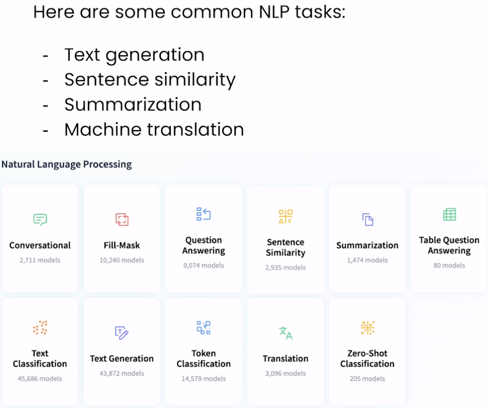
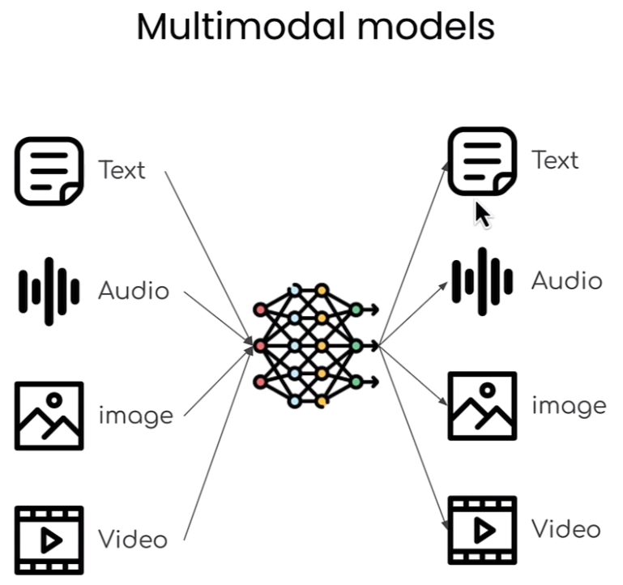

# 🚀 [Open Source Models with Hugging Face](https://learn.deeplearning.ai/courses/open-source-models-hugging-face/lesson/1/introduction)

💻 Welcome to the "Open Source Models with Hugging Face" course! Instructed by Maria Khalusova, Marc Sun, and Younes Belkada, all Machine Learning Engineers at Hugging Face, this course will equip you with the skills to leverage open-source models from Hugging Face Hub for various NLP, audio, image, and multimodal tasks.

## 🤗 [Hugging Face Library](https://huggingface.co/docs/hub/en/index)

 

## Course Summary
In this course, you'll learn how to harness the power of open-source models available on Hugging Face Hub for a wide range of tasks in NLP, audio, image, and multimodal domains. Here's what you can expect to learn and experience:

1. 🤖 **Building AI Applications**: Use the transformers library to build AI applications for NLP, audio, image, and multimodal tasks.

 

2. 🚀 **Packaging Code**: Package your code into user-friendly apps that can run on the cloud using Gradio and Hugging Face Spaces.
3. 🔍 **Task Performance**: Perform tasks like translation, summarization, similarity measurement, audio transcription, text-to-speech, audio classification, image narration, and object identification.

## Key Points
- 📦 Find and filter open-source models on Hugging Face Hub for various tasks.
- 🛠 Write minimal code using the transformers library to perform text, audio, image, and multimodal tasks.
- 🌐 Share your AI applications with a user-friendly interface or via API and deploy them on the cloud using Gradio and Hugging Face Spaces.

## About the Instructors
🌟 **Maria Khalusova**, **Marc Sun**, and **Younes Belkada** are Machine Learning Engineers at Hugging Face, bringing extensive expertise to guide you through leveraging open-source models for your AI applications.

🔗 To enroll in the course or for further information, visit [deeplearning.ai](https://www.deeplearning.ai/short-courses/).
